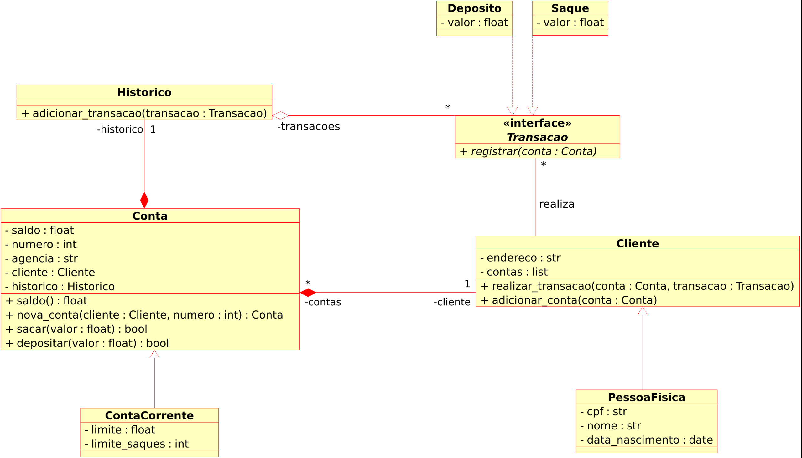

# Desafio: Criando um sistema bancário em POO com Python

## Objetivo Geral

Iniciar a modelagem do sistema bancário em POO. Adicionar classes para cliente e as operações bancárias: depósito e saque.

## Desafio

Atualizar a implementação do sistema bancário, para armazenar os dados de clientes e contas bancárias em objetos ao invés de dicionários. O código deve seguir o modelo de classes UML a seguir:

## Conclusão

O codigo para o desafio proposto foi desenvolvido em Python e transforma o codigo baseado em funções em POO. O resultado desse código está disponível neste [arquivo.py](./desafio.py)